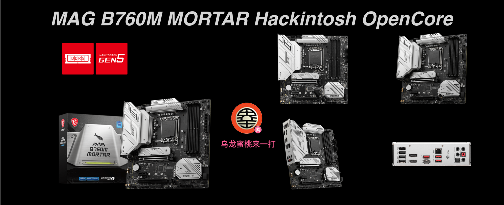
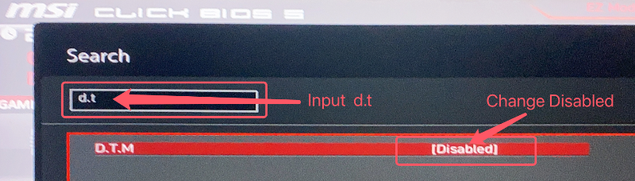
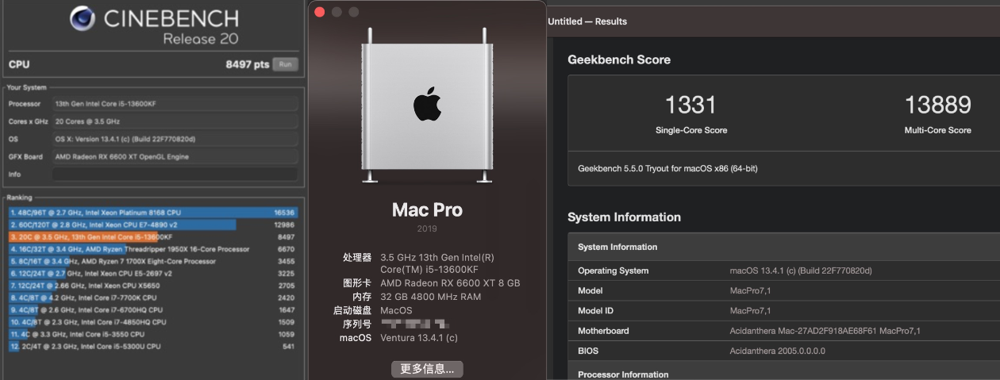

## MAG B760M MORTAR 黑苹果 OpenCore EFI



### [ENGLISH](https://github.com/hackintosh-club/MAG-B760M-MORTAR-OpenCore)


### OpenCore

[OpenCore 0.9.3](https://github.com/acidanthera/OpenCorePkg)


### macOS

- Ventura
- Monterey


### 硬件

- 芯片组: B760
- BIOS版本: 7E01vM3 2023-05-19
- 处理器: 英特尔13代 i5-13600KF
- 内存: 金百达 A-Die 32GB(16GB*2) DDR5 6000 Mhz
- 硬盘: 梵想  Fanxiang S790 1TB Windows
- 硬盘: 致态 TiPlus 7100 1TB MacOS
- 显卡: ASUS Dual Radeon RX 6600 XT 8GB GDDR6 雪豹
- 声卡: 瑞昱 ALC897
- 有线网卡: 瑞昱 RTL8125 Gaming 2.5GbE
- 无线网卡: 英特尔
- 处理器散热: 利民 240 冰封幻境 一体式水冷散热器 ARGB LGA1700 黑色
- 机箱:  玩嘉 铝元素紧凑机箱 MATX (黄色)
- 电源:  鑫谷 GM750W ATX 80 金牌全模组


### BIOS设置

```
1.关闭安全启动
Settings
  |-- Security
     |-- Secure Boot
       |-- Secure Boot: Disabled

2.使用搜索功能查找并启用 D.T.M 
Search
  |-- D.T.M
    |-- D.T.M: Enabled

```





### 注意事项

 - 安装成功后必须使用 [OpenCore Configurator](https://mackie100projects.altervista.org/opencore-configurator/) 或者 [OCAuxiliaryTools](https://github.com/ic005k/OCAuxiliaryTools) 生成你自己的 SMBIOS

### 系统截图




### 常用工具

- [Hackintool](https://github.com/headkaze/Hackintool) 
- [OCAuxiliaryTools](https://github.com/ic005k/OCAuxiliaryTools) AKA `OCAT`.
- [OpenCore Configurator](https://mackie100projects.altervista.org/opencore-configurator/) AKA `OCC`.
- [gibMacOS](https://github.com/corpnewt/gibMacOS) Build your own MacOS image.
- [ProperTree](https://github.com/corpnewt/ProperTree) Plist editor.


### 联系我们

QQ Group: 23304408


